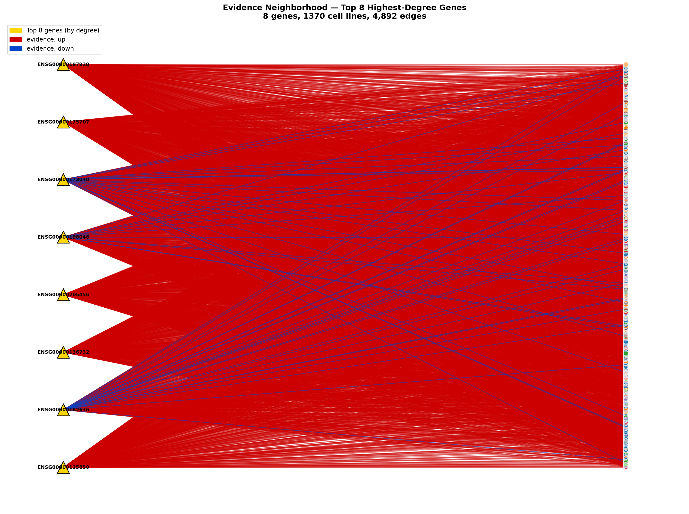
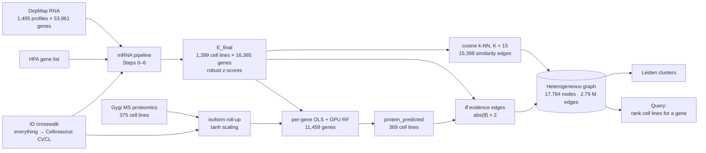
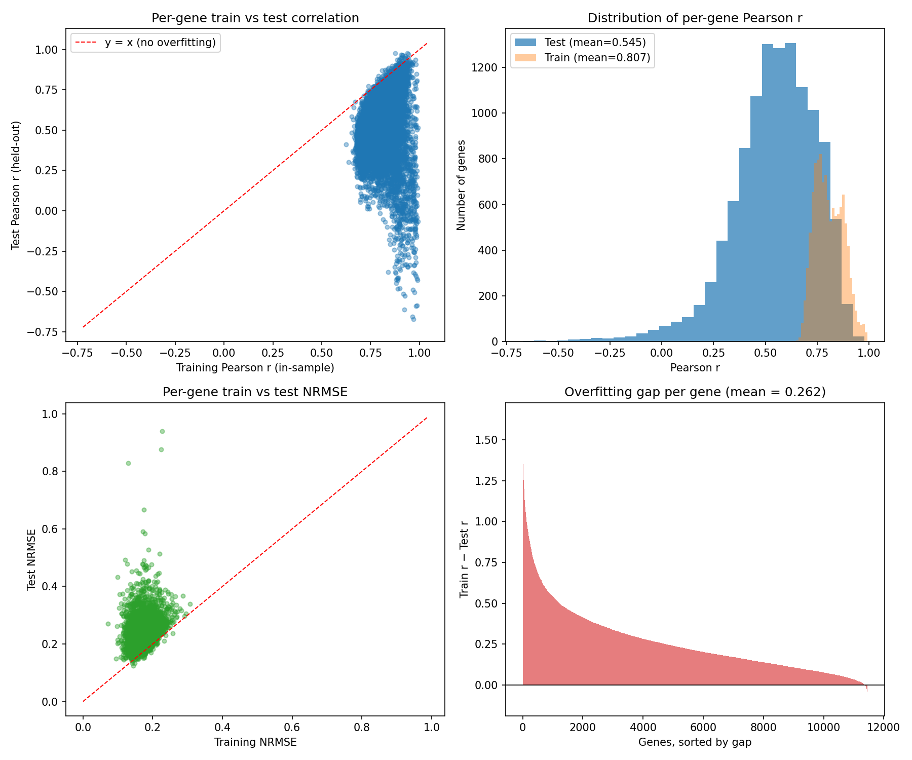
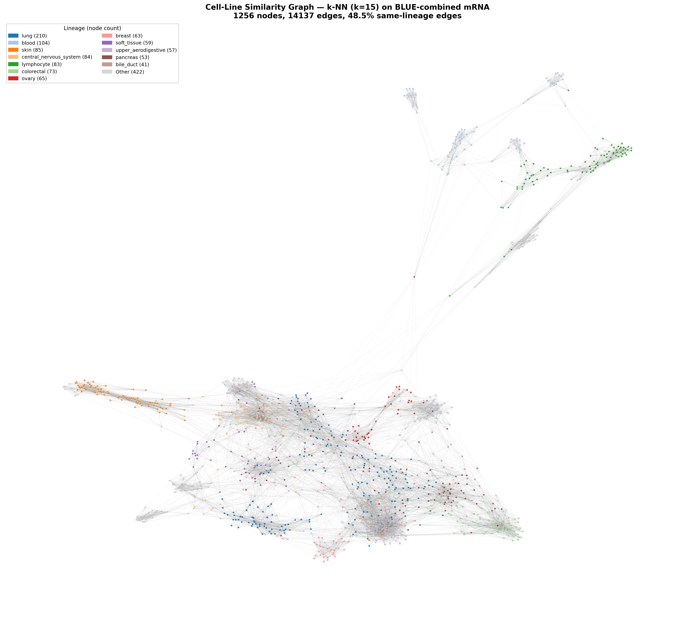
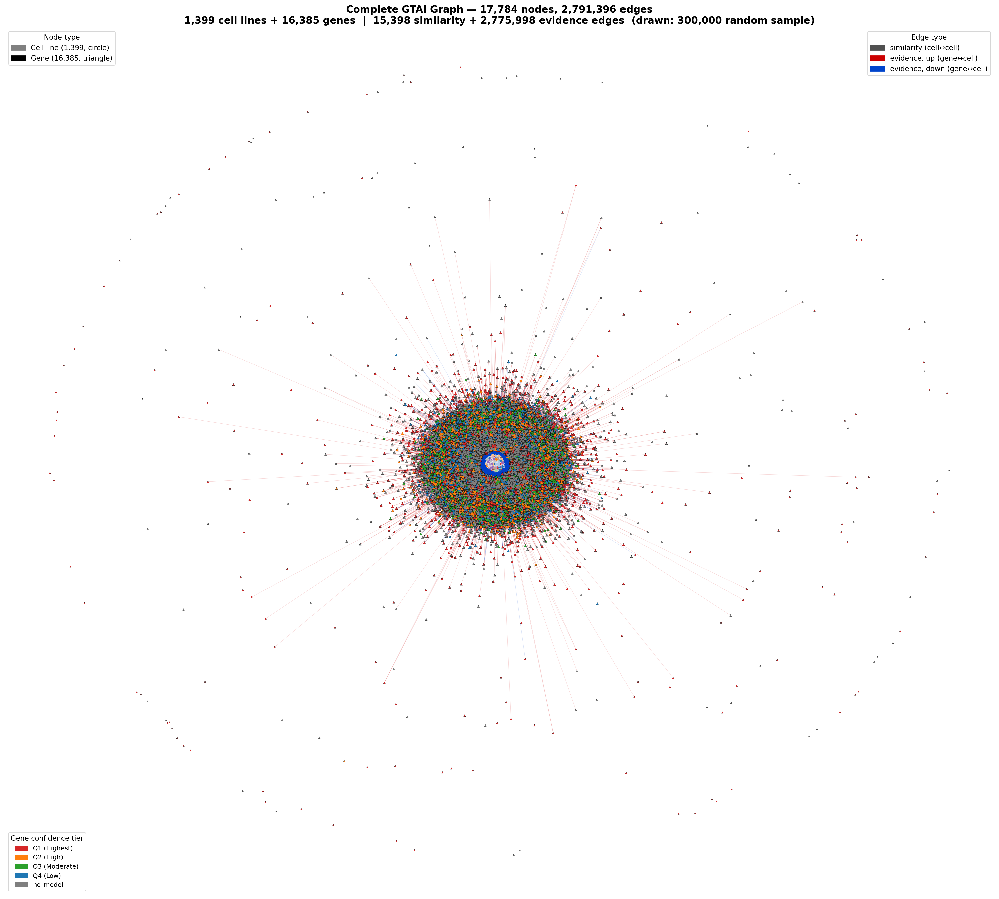

# GeneTrace AI — Cell Line Finder (Graph PoC)

A proof of concept that turns public cancer cell line omics data into a **heterogeneous graph** of cell lines and genes. You can then ask it: *"for gene X, which cell lines behave unusually, and what are those cell lines like?"*

The whole pipeline lives in one notebook, [`GTAI_GraphPOC.ipynb`](GTAI_GraphPOC.ipynb). It runs on Google Colab (free T4 GPU) or locally on Linux/WSL2.

> **Status:** proof of concept. The numbers below come from the saved run in the notebook. Known limitations are listed [below](#known-limitations). Read them before drawing biological conclusions.

---

## Contents

1. [The problem](#the-problem)
2. [Why a graph](#why-a-graph)
3. [Data](#data)
4. [Pipeline](#pipeline)
5. [Method in detail](#method-in-detail)
6. [Results](#results)
7. [Worked example: TP53](#worked-example-tp53)
8. [Known limitations](#known-limitations)
9. [Engineering notes](#engineering-notes)
10. [How to run](#how-to-run)
11. [Repository layout](#repository-layout)
12. [Next steps](#next-steps)
13. [References](#references)

---

## The problem

Choosing the right cell line for an experiment is a common, slow step in cancer research. A scientist studying a gene usually wants to know:

- which cell lines express that gene unusually highly or lowly,
- whether that holds at the **protein** level, not just the mRNA level,
- which other cell lines are similar to a candidate, to find alternatives or controls.

The data to answer this exists, but it is fragmented:

| Difficulty | What it looks like in practice |
|---|---|
| **Different identifiers** | DepMap uses ProfileIDs and ModelIDs (`ACH-…`), HPA uses cell line names, GEO uses sample accessions (`GSM…`). The same cell line has different names in every source. |
| **Different scales** | log2(TPM+1), raw TPM, microarray intensities and MS protein ratios can't be compared directly. |
| **Protein data is sparse** | mRNA exists for ~1,400 cell lines, but mass-spec proteomics covers only 375. |
| **No single place to query** | Evidence has to be re-assembled by hand for every gene. |

## Why a graph

A graph makes the question above a **neighbourhood lookup** and keeps all the evidence in one structure.

- **Two node types**
  - `cell_line` (1,399), keyed by Cellosaurus accession (`CVCL_xxxx`)
  - `gene` (16,385), keyed by Ensembl ID
- **Two edge types**
  - `similarity` (cell line ↔ cell line): whole-transcriptome cosine k-NN. Answers *"what is this cell line like?"*
  - `evidence` (gene ↔ cell line): the gene is a robust outlier in that cell line, with |θ̂| > 2. Answers *"where is this gene unusual?"*
- Nodes and edges carry **attributes**:
  - on genes: model confidence tier, symbol
  - on cell lines: lineage, Leiden cluster
  - on edges: θ̂, direction, evidence type

  Every answer comes with its provenance.

- **Protein evidence fills gaps.** Where protein wasn't measured, a per-gene model predicts it from mRNA. The evidence edge then combines mRNA and protein (Stouffer's method) wherever both exist.

<p align="center"></p>

---

## Data

All 14 files sit in `data/`, which is **not** committed (size, and each provider's own terms). Download them from the original providers.

| # | File | Source | Used for |
|---|---|---|---|
| 1 | `1_4_hpa_rna_celline.tsv` | Human Protein Atlas (cell line RNA) | Protein-coding gene universe; Ensembl ↔ symbol crosswalk |
| 2 | `2_DepMap_OmicsExpressionAllGenesTPMLogp1Profile.csv` | DepMap Public | **mRNA features, similarity and evidence edges** |
| 3 | `3_GEOexpression.txt` | NCBI GEO (prepared subset) | EDA only |
| 4 | `4_Harmonized_MS_CCLE_Gygi_subsetted.csv` | CCLE mass-spec proteomics (Nusinow et al., 2020) | **Protein targets** |
| 5 | `5_OmicsFusionFilteredSupplementary.csv` | DepMap Public | EDA only |
| 6 | `6_OmicsSomaticMutationsProfile.csv` | DepMap Public | EDA only |
| 7 | `7_cellosaurus.csv` | Cellosaurus | Cell line names in results |
| 8 | `8_DepMap_OmicsProfiles.csv` | DepMap Public | ProfileID → ModelID |
| 9 | `9_DepMap_sample_info.csv` | DepMap Public | ModelID → Cellosaurus RRID, lineage |
| 10 | `10_GEOInfo.txt` | NCBI GEO (prepared sample annotation) | EDA only |
| 11 | `11_hpa_rna_celline_description.tsv` | Human Protein Atlas | HPA cell line → Cellosaurus |
| 12 | `12_CCLE_metabolomics_20190502.csv` | CCLE (DepMap portal) | EDA only |
| 13 | `13_CCLE_miRNA_20181103.gct` | CCLE (DepMap portal) | EDA only |
| 14 | `14_OmicsGlobalSignatures.csv` | DepMap Public | EDA only |

Portals: [DepMap data](https://depmap.org/portal/data_page/) · [Human Protein Atlas downloads](https://www.proteinatlas.org/about/download) · [Cellosaurus](https://www.cellosaurus.org/) · [NCBI GEO](https://www.ncbi.nlm.nih.gov/geo/).
The file names must match the table exactly. The notebook reads them from `data/` by name.

---

## Pipeline



---

## Method in detail

### 1. Identifier crosswalk

Every table is joined on the **Cellosaurus accession**.

- **DepMap:** ProfileID → ModelID (`8_DepMap_OmicsProfiles`) → RRID (`9_DepMap_sample_info`). 1,428 profiles map, covering 1,400 cell lines.
- **HPA:** cell line name → Cellosaurus (`11_hpa_rna_celline_description`). 1,199 cell lines.
- **Proteomics:** ModelID → RRID. 375 cell lines, none dropped.

### 2. mRNA pre-processing (DepMap only)

| Step | Operation | Result |
|---|---|---|
| 0 | Keep genes in HPA's gene universe (protein-coding restriction) | 53,961 → **19,896** genes |
| 1 | Drop genes missing in > 20 % of cell lines | 19,896 (none dropped) |
| 2 | Median-impute remaining NaNs per gene | 0 NaNs |
| 3 | Drop zero-variance genes | 19,895 |
| 4 | Robust z-score per gene; drop genes with MAD = 0 | **16,385** genes (3,510 dropped) |
| 6 | Re-index ProfileID → Cellosaurus, average duplicate profiles | **1,399 cell lines × 16,385 genes** (`E_final`) |

Robust z-score (Iglewicz & Hoaglin, 1993):

$$z_{g,c} = \frac{x_{g,c} - \operatorname{median}_g}{1.4826 \cdot \operatorname{MAD}_g}$$

The factor 1.4826 makes the MAD a consistent estimator of σ under normality. `scipy.stats.median_abs_deviation` defaults to the raw MAD, so the code passes `scale='normal'` explicitly.

### 3. Proteomics target

- **Isoform roll-up.** When a gene has several protein isoforms:
  - they are averaged if their mean pairwise |Spearman ρ| exceeds a permutation-null 95th percentile (0.0972);
  - otherwise the row-wise maximum is used.
  - Result: 11,730 single-isoform genes, 385 averaged, 11 taken by maximum.
- **Mapping.** Rows go to Cellosaurus and columns to Ensembl IDs, giving a 375 × 12,036 matrix.
- **Robust bounded scaling:**

  $$y = \tanh\left(\frac{p}{k_{Pr}}\right), \qquad k_{Pr} = 1.4826 \times \mathrm{IQR}(p) = 1.3682$$

- **Alignment with `E_final`:** 369 cell lines × 11,716 genes. **11,459 genes** have at least 20 measured cell lines and are modelled.

### 4. Per-gene protein model

For each of the 11,459 genes:

1. **Stage 1** — OLS regression of protein on the gene's own mRNA.
2. **Stage 2** — cuML GPU Random Forest on **all 16,385 mRNA features** (`max_depth=3`, `n_estimators=100`, `max_features='sqrt'`, `bootstrap=True`, `n_bins=min(32, n)`, `n_streams=1`, `random_state=42`).
3. **Ensemble** — 0.5 × Stage 1 + 0.5 × Stage 2.

Evaluation uses one 70/30 train/test split (`random_state=42`). Metrics are:

- Spearman r (used for the confidence tiers) and NRMSE, the metrics used to benchmark methods for the DREAM proteogenomics sub-challenge (Eicher et al., 2019),
- Pearson r, reported as well.

Each gene's held-out Spearman r places it in a quartile tier, **Q1 (Highest) … Q4 (Low)**. The model is then refit on all measured cell lines and fills in the missing protein values → `protein_predicted`.

### 5. Cell-line similarity edges

- Cosine similarity between every pair of cell-line profiles in `E_final` (1,399 × 1,399).
- Keep each cell line's **top K = 15** neighbours. Symmetrising (union) gives **15,398 undirected edges**.
- Note: this is cosine similarity on per-gene-centred z-scores, **not** Pearson correlation (that equivalence would need per-cell-line centring).

### 6. Gene ↔ cell-line evidence edges

- Both arms are robust z-scored per gene, then combined with Stouffer's method:

  $$\hat\theta_{g,c} = \begin{cases} \dfrac{z^{E}_{g,c} + z^{Pr}_{g,c}}{\sqrt{2}} & \text{mRNA and protein available (369 proteomics cell lines)} \\[2ex] z^{E}_{g,c} & \text{mRNA only} \end{cases}$$

- An edge is kept when **|θ̂| > 2**. Each edge stores θ̂, |θ̂|, direction (`up` / `down`) and evidence type (`mRNA+protein` / `mRNA_only`).

### 7. Graph, clustering and queries

- **Graph.** One `networkx` graph holds both node types and both edge types.
- **Leiden community detection** (`leidenalg`, `RBConfigurationVertexPartition`, resolution 1.0, seed 42):
  - runs on the **similarity edges only**, so the 2.8 M evidence edges don't swamp the partition;
  - each cluster is checked against the known lineage labels.
- **Query functions** in the notebook:

| Function | Answers |
|---|---|
| `rank_cell_lines_for_gene(gene, G, node_lineage, direction=None, top_n=20)` | Cell lines ranked by \|θ̂\| for a gene (symbol or Ensembl ID), optionally only `up` or `down`. Reports absence explicitly instead of returning noise. |
| `query_network(gene=..., cell_line=...)` | Leiden clusters ranked by evidence strength for a gene; a cell line's cluster, lineage mix and top evidence genes; the direct edge if both are given. |
| `gene_conditioned_neighbors(gene, cell_line, E_final, node_lineage)` | Nearest cell lines using only the 200 genes most correlated with the query gene. |

---

## Results

### Protein prediction (held-out 30 %, 11,459 genes, 0 skipped)

| Metric | Train | Test |
|---|---|---|
| Mean Pearson r | 0.8073 | **0.5449** |
| Mean NRMSE | 0.1722 | 0.2214 |
| Mean Spearman r | — | 0.5072 |

The train–test gap (0.26) shows some overfitting, even with shallow trees (`max_depth=3`).

<p align="center"></p>

### Cell-line similarity graph

| | |
|---|---|
| Nodes / edges | 1,399 / 15,398 (one connected component) |
| Degree | min 15, median 20, mean 22.0, max 75 |
| Same-lineage edges | 54.6 % |
| Mismatched edges explained by adjacent lineages | 6.9 % of all edges (38.5 % unexplained) |

<p align="center"></p>

### Heterogeneous graph

| | |
|---|---|
| Nodes | 17,784 (16,385 genes + 1,399 cell lines) |
| Edges | 2,791,396 = 15,398 similarity + 2,775,998 evidence |
| Evidence direction | 2,111,372 up · 664,626 down |
| Evidence type | 577,876 mRNA+protein · 2,198,122 mRNA only |
| Genes with ≥ 1 evidence edge | 16,292 (93 isolated) |
| Gene symbols resolved | 16,385 / 16,385 |

The full-graph figure draws a fixed random sample of 300,000 evidence edges; the layout uses all edges.

<p align="center"></p>

### Leiden clusters (similarity edges)

- **19 clusters**, modularity **0.822**, size-weighted lineage purity **0.519**.
- Some lineages are recovered cleanly: skin (purity 0.83), lymphocyte (0.82), lung (0.73).
- Others mix heavily: central nervous system (0.28), upper aerodigestive (0.33), colorectal (0.37).

---

## Worked example: TP53

```python
rank_cell_lines_for_gene("TP53", G=G, node_lineage=node_lineage, top_n=20)
```

TP53 (ENSG00000141510) has a protein-model tier of **Q1 (Highest)** and **153 evidence cell lines**. The top 10:

| Rank | Cell line | θ̂ | Direction | Evidence | Lineage |
|---|---|---|---|---|---|
| 1 | NP-8 | −4.84 | down | mRNA only | central nervous system |
| 2 | MM386 | −4.74 | down | mRNA only | skin |
| 3 | CAL-72 | −4.64 | down | mRNA only | bone |
| 4 | JJN-3 | −4.51 | down | mRNA only | plasma cell |
| 5 | SCC-3 | −4.38 | down | mRNA only | lymphocyte |
| 6 | PE/CA-PJ49 | −4.27 | down | mRNA only | upper aerodigestive |
| 7 | OS252 | −4.15 | down | mRNA only | bone |
| 8 | NCC-LMS1-C1 | −4.09 | down | mRNA only | soft tissue |
| 9 | TGBC52TKB | −4.09 | down | mRNA only | bile duct |
| 10 | Pfeiffer | −3.98 | down | mRNA only | lymphocyte |

**How to read it**

- **What θ̂ means.** θ̂ = −4.84 means NP-8's TP53 mRNA is about 4.8 robust standard deviations below the median across 1,399 cell lines.
- **All top hits are `down`, which is expected biologically.**
  - Deletions remove TP53 mRNA, and truncating mutations lower it through nonsense-mediated decay.
  - The most common TP53 alterations are missense. They stabilise the *protein* and leave mRNA largely unchanged.
- **So the ranking finds TP53-low / likely-null lines.** It doesn't find TP53 missense mutants.
- **Spot check.** KATO III (rank 11, the one mRNA+protein row) carries a **homozygous TP53 deletion** in Cellosaurus, which is consistent. The other lines have not been systematically validated.
- **The confidence tier.** It describes the protein model and only affects rows with protein evidence.
- **Tied θ̂ values.** Rows with identical θ̂ values (ranks 8–9) most likely have identical TPM values; DepMap reports TPM in 0.01 steps.

---

## Known limitations

- **Tiny-MAD inflation.**
  - Genes whose MAD is not zero but very small (mostly unexpressed genes) get very large z-scores.
  - The top-degree genes have a mean |θ̂| of 24–36, and they dominate degree and hub rankings.
  - The 3,510 genes with MAD = 0 are dropped entirely, which also removes many lineage-restricted markers.
- **Expression ≠ mutation status.** Evidence edges capture expression outliers. Mutation and fusion flags (files 5 and 6) are profiled but not yet attached to the graph.
- **Mixed train/test splits.**
  - 10,133 genes were trained before the gene/cell order was made deterministic, and 1,326 after.
  - Every gene has a valid 70/30 split with identical settings, but not the *same* split.
  - `FORCE_RETRAIN = True` puts all genes on one split (~5 h on a T4).
- **One split, no cross-validation.** Per-gene confidence rests on a single held-out split.
- **Modest lineage recovery.** Leiden purity (0.52) doesn't beat the 54.6 % same-lineage share of the k-NN edges.
- **Single mRNA source.** Only DepMap RNA feeds the graph; HPA, GEO, metabolomics and miRNA aren't integrated yet.
- **Not validated systematically.** The TP53 check above is a spot check, not a benchmark.

---

## Engineering notes

A few problems solved on the way that are worth knowing if you extend this:

- **GPU training on a free T4.**
  - 11,459 per-gene forests take **~282 min** at ~1.47 s/gene.
  - The feature matrix is uploaded to the GPU once and rows are selected there.
  - Test and train predictions share one inference call.
  - `n_streams=4` was benchmarked: only 6.5 % faster, and non-reproducible, so `n_streams=1` is kept.
- **Resumable, reusable training.**
  - Results are saved to `gtai_rf_chunks/` every 250 genes, so a disconnected Colab session loses at most one chunk.
  - Saved results are looked up **by gene ID** and accepted only if the model settings **and a fingerprint of the input data** match.
  - After a complete run everything is consolidated into `rf_results_all.pkl`. A re-run then loads in about 10 s and trains 0 genes.
- **A reproducibility bug.**
  - `list(set(...))` of gene and cell-line IDs gives a different order in every Python session (hash randomisation).
  - As a result, the "seeded" split changed from run to run.
  - Fixed with `sorted(...)`.
- **Memory on a 12.7 GB runtime.**
  - Raw tables not needed after pre-processing are freed, taking RAM from 8.2 GB to 5.5 GB before training.
  - Evidence edges are streamed into the graph instead of being built as intermediate lists.
  - Before these fixes, the graph stage ran out of memory.

---

## How to run

### Requirements

- Python 3.10+ with the packages in [`requirements.txt`](requirements.txt) (pandas, numpy, scipy, scikit-learn, networkx, python-igraph, leidenalg, matplotlib, seaborn, joblib, psutil).
- **Training the protein models** needs an NVIDIA GPU with RAPIDS cuML (`cudf-cu12`, `cuml-cu12`). On Colab the notebook installs these itself.
- **No GPU?** Everything else runs on CPU, *provided* `gtai_rf_chunks/rf_results_all.pkl` from an earlier run is present.
- **Memory:** ~12 GB RAM (8.3 GB in use just before the cleanup cell on Colab).
- **Disk:** a few GB for `data/`.

### Option A — Google Colab (recommended)

1. **Set up the Drive folder:**
   ```
   My Drive/Colab Notebooks/GTAI-GraphPOC/
   ├── data/                  # the 14 files, names exactly as in the Data table
   └── GTAI_GraphPOC.ipynb
   ```
   From a second Google account: share the folder as **Editor**, then in that account's Drive right-click it → *Organize → Add shortcut → My Drive*.
2. **Open the notebook in Colab.** *Runtime → Change runtime type → T4 GPU.*
3. ***Runtime → Run all*** and allow Drive access when asked. The setup cell should print `Data files: 14`.
4. **First run:** ~5 h of GPU training.
   - Free sessions can disconnect. If that happens, reconnect and *Run all* again; finished genes are loaded, not retrained.
5. **Later runs:** load `rf_results_all.pkl` and train 0 genes. A CPU runtime is enough.

### Option B — Local (Linux or WSL2)

```bash
git clone <this-repo> graph-poc && cd graph-poc
python3 -m venv graph_poc_venv && source graph_poc_venv/bin/activate
pip install -r requirements.txt

# GPU training only (NVIDIA driver + CUDA 12):
pip install cudf-cu12 cuml-cu12 --extra-index-url=https://pypi.nvidia.com

# put the 14 input files in ./data/, then either
jupyter lab                          # open GTAI_GraphPOC.ipynb and Run All
# or run headless and keep a log:
jupyter nbconvert --to notebook --execute --ExecutePreprocessor.timeout=-1 \
    GTAI_GraphPOC.ipynb --output GTAI_GraphPOC.run.ipynb
```

- The setup cell finds the project folder automatically: the current directory, or the `GTAI_PROJECT_DIR` environment variable.
- To reuse results trained on Colab, copy `gtai_rf_chunks/rf_results_all.pkl` from Drive into `./gtai_rf_chunks/`.

### Useful switches

| Setting | Where | Default | Effect |
|---|---|---|---|
| `FORCE_RETRAIN` | RF results cell | `False` | Ignore every saved result and retrain all genes |
| `MAX_EVIDENCE_EDGES_TO_DRAW` | full-graph figure | `300_000` | `None` draws all 2.8 M edges (slow, ~1 GB) |
| `SAVE_PER_GENE_MODELS` | model cell | `False` | Also pickle the fitted models (22,918 files) |
| `K` | k-NN cell | `15` | Neighbours per cell line |
| `threshold` | `compute_bipartite_evidence` | `2.0` | \|θ̂\| cut-off for evidence edges |
| `min_measured_limit` | alignment cell | `20` | Minimum measured cell lines to model a gene |

### Outputs (`outputs/`)

| File | Content |
|---|---|
| `cellline_knn_edges.csv` | 15,398 similarity edges with cosine weight and lineages |
| `cellline_nodes.csv` | 1,399 cell-line nodes with lineage |
| `cellline_graph_*.png` | Similarity graph: diagnostics, full network, top-3 lineages, hub analysis |
| `protein_model_train_vs_test.png` | Per-gene train vs test performance |
| `combined_graph_full.png`, `combined_graph_gene_ego.png` | Heterogeneous graph and top-gene neighbourhoods |

---

## Repository layout

```
.
├── GTAI_GraphPOC.ipynb   # the whole pipeline, with outputs from the reference run
├── README.md
├── requirements.txt
├── .gitignore
├── outputs/              # figures and CSVs from the reference run
├── data/                 # 14 input files        — not tracked
├── gtai_rf_chunks/       # cached model results  — not tracked
└── graph_poc_venv/       # local virtual env     — not tracked
```

---

## Next steps

- **Validate the rankings against mutation data.** Precision@k of TP53 `down` hits for truncating mutations or deletions (file 6), compared with the base rate.
- **Fix tiny-MAD inflation.** Floor the MAD, or fall back to 1.253314 × mean absolute deviation (the modified-z convention), and keep lineage-restricted genes.
- **Attach mutation and fusion flags** as gene–cell-line edge attributes, so results can separate "low expression" from "mutated".
- **Cross-validate** the per-gene models (k-fold) instead of relying on one split.
- **Package the query functions** behind a small API.

---

## References

Full list in the last cell of the notebook. Key sources:

1. M. Ghandi et al., "Next-generation characterization of the Cancer Cell Line Encyclopedia," *Nature* 569, 503–508, 2019.
2. D. P. Nusinow et al., "Quantitative Proteomics of the Cancer Cell Line Encyclopedia," *Cell* 180(2), 387–402, 2020.
3. M. Uhlén et al., "Tissue-based map of the human proteome," *Science* 347(6220), 1260419, 2015.
4. A. Bairoch, "The Cellosaurus, a Cell-Line Knowledge Resource," *J. Biomol. Tech.* 29(2), 25–38, 2018.
5. B. Iglewicz and D. C. Hoaglin, *How to Detect and Handle Outliers*, ASQC Quality Press, 1993.
6. S. A. Stouffer et al., *The American Soldier*, Vol. 1, Princeton University Press, 1949.
7. L. Breiman, "Random Forests," *Machine Learning* 45(1), 5–32, 2001.
8. V. A. Traag, L. Waltman and N. J. van Eck, "From Louvain to Leiden: guaranteeing well-connected communities," *Sci. Rep.* 9, 5233, 2019.
9. T. Eicher et al., "Challenges in proteogenomics: a comparison of analysis methods with the case study of the DREAM proteogenomics sub-challenge," *BMC Bioinformatics* 20 (Suppl 24), 2019.

---

**Context.** This PoC grew out of an MSc Data Science group project at the University of Bristol (2025–26) and is now continued independently as a personal project.

**Author:** Thiruvel A P
